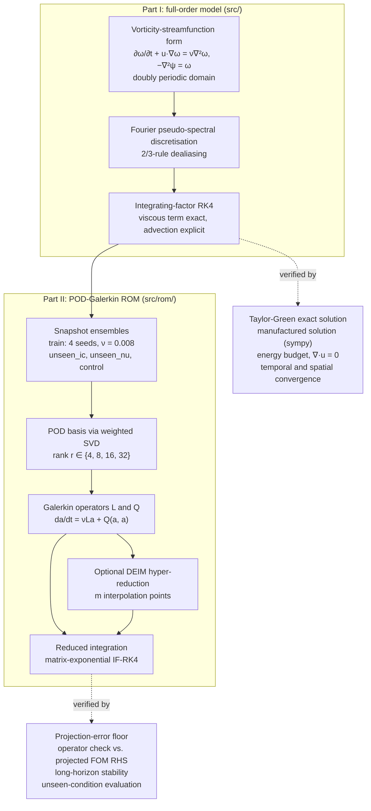
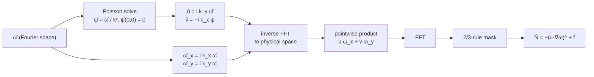
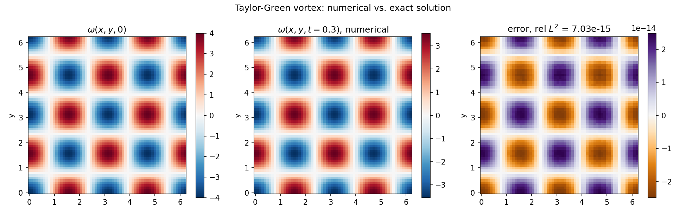
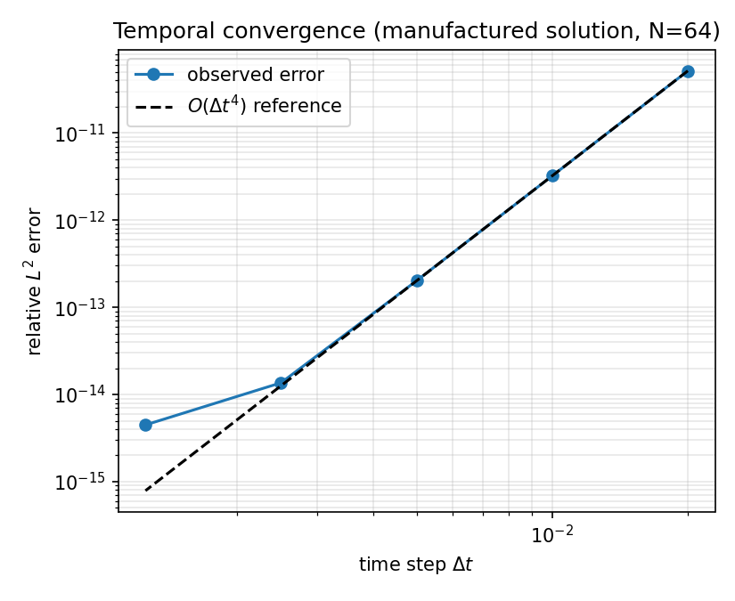
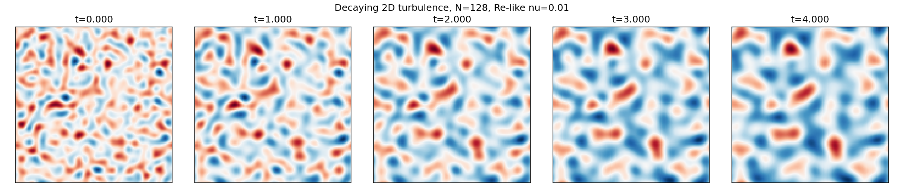
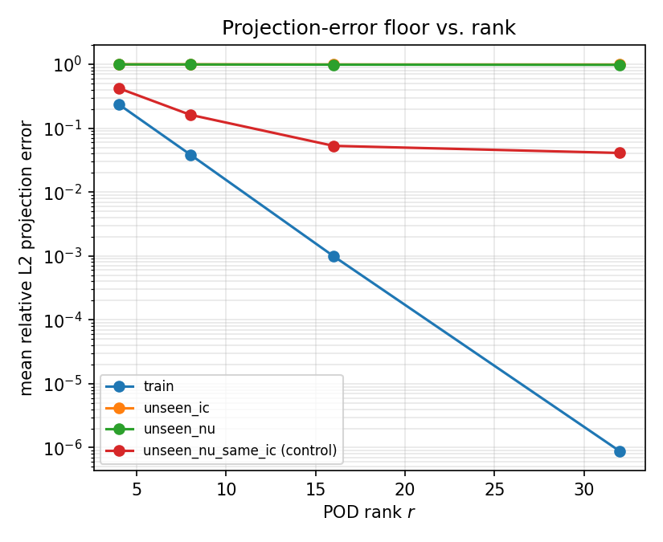
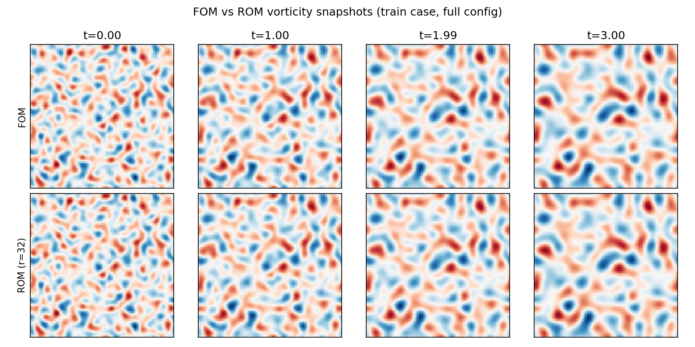
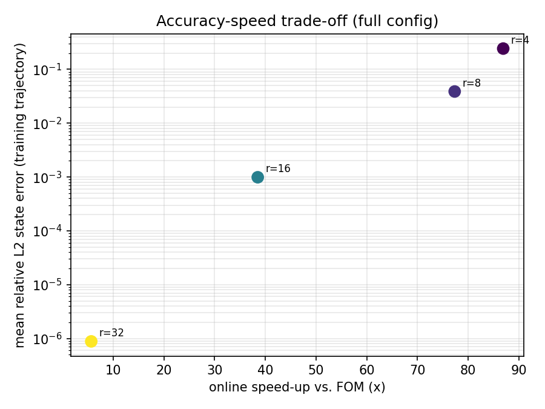

# 2D Incompressible Navier-Stokes: Pseudo-Spectral Solver and POD-Galerkin Reduced-Order Model

**Part I** is a verified pseudo-spectral solver for the 2D incompressible Navier-Stokes equations on
a doubly periodic domain, validated against the Taylor-Green vortex exact solution and a symbolically
derived manufactured solution, with a second benchmark (freely decaying 2D turbulence) assessed
through physical diagnostics (incompressibility, the viscous energy-dissipation budget) and spatial
self-convergence. **Part II** builds a POD-Galerkin reduced-order model (ROM) on top of this verified
solver: snapshot generation, a proper-orthogonal-decomposition basis with an explicit
projection-error baseline, a Galerkin-projected reduced dynamical system with independently-verified
reduced operators, a stability investigation, DEIM hyper-reduction, and a quantified accuracy-speed
trade-off.

## Overview

Part I implements and validates a classical numerical method for 2D incompressible flow rather than
proposing a new one. The goal is to demonstrate the complete workflow expected of a credible
numerical-PDE implementation: formulate the equations, choose and justify a discretisation,
implement it as reusable code, verify it against problems with known answers (an exact solution and
a manufactured solution), quantify convergence rates, verify physical diagnostics (incompressibility,
the viscous energy-dissipation budget), and only then use the solver for a flow-physics
experiment. Part II treats this verified solver as a trusted full-order model (FOM) and demonstrates
reduced-order modelling as applied mathematics: every reduction step (POD truncation, Galerkin
projection, hyper-reduction) is derived, then checked against an independent reference BEFORE being
trusted for the next step, exactly as Part I's own solver was checked before being used for a flow
experiment.

The two parts form one pipeline. Each verification step (right-hand column) is completed before the
output on its left is used by the next stage:



# Part I: Full-Order Pseudo-Spectral Solver

## Mathematical problem

The 2D incompressible Navier-Stokes equations, in velocity-pressure form, are

$$\partial_t \mathbf{u} + (\mathbf{u}\cdot\nabla)\mathbf{u} = -\nabla p + \nu\nabla^2 \mathbf{u}, \qquad \nabla\cdot\mathbf{u} = 0,$$

on the doubly periodic domain $[0, L_x)\times[0, L_y)$. In two dimensions it is standard, and
mathematically convenient, to work instead with the scalar vorticity
$\omega = \partial_x v - \partial_y u$ and a streamfunction $\psi$ satisfying $\nabla\cdot\mathbf{u}=0$
automatically. Taking the curl of the momentum equation eliminates the pressure entirely, giving a
single scalar transport equation:

$$\partial_t \omega + \mathbf{u}\cdot\nabla\omega = \nu\nabla^2\omega, \qquad \mathbf{u} = (\partial_y\psi,\, -\partial_x\psi), \qquad -\nabla^2\psi = \omega.$$

## Governing equations and numerical method

**Why vorticity-streamfunction, and why pseudo-spectral.** On a periodic domain with no solid
boundaries, the vorticity-streamfunction formulation removes both the pressure (a Poisson equation
that would otherwise have to be solved for $p$) and the incompressibility constraint (satisfied
identically by construction, not enforced iteratively as in a velocity-pressure projection method).
What remains is a single scalar advection-diffusion-type equation plus one Poisson solve per time
step. On a periodic domain, the Fourier basis diagonalises every differential operator that appears
(gradient, Laplacian, and hence the Poisson solve), so a Fourier pseudo-spectral discretisation turns
every linear operation into an elementwise multiplication and gives spectral (faster than any fixed
polynomial order) accuracy in space for smooth solutions, at the cost of $O(N^2\log N)$ FFTs per
evaluation of the right-hand side. This is the standard method of choice for periodic 2D
incompressible flow and turbulence studies (Orszag, 1971; Canuto et al., 2006).

**Discretisation, term by term** (implementation in `src/`):

- *Fourier differentiation and the streamfunction Poisson equation* (`src/grid.py`,
  `src/operators.py`): on an $N_x\times N_y$ grid, wavenumbers $(k_x, k_y)$ are obtained from
  `numpy.fft.fftfreq`; any derivative $\partial_x$ becomes multiplication by $ik_x$ in Fourier space.
  The Poisson equation $-\nabla^2\psi=\omega$ becomes $\hat\psi = \hat\omega / (k_x^2+k_y^2)$,
  elementwise, in $O(N^2\log N)$ via FFT.
- *The zero Fourier mode*: $k=0$ makes the Poisson divisor singular. This is the usual
  compatibility condition for a periodic Poisson equation: $\psi$ is only defined up to an additive
  constant, which does not affect $\mathbf{u}=\nabla^\perp\psi$, so $\hat\psi(0,0)$ is set to zero by
  convention (`operators.poisson_solve`).
- *Velocity recovery*: $\hat u = ik_y\hat\psi$, $\hat v = -ik_x\hat\psi$. Because both components come
  from derivatives of the same scalar $\psi$, $\nabla\cdot\mathbf{u} = \partial_x u + \partial_y v =
  -k_xk_y\hat\psi + k_xk_y\hat\psi \equiv 0$ **identically**, to machine precision, by construction
  (verified in `tests/test_operators.py::test_velocity_from_psi_is_divergence_free` and tracked
  through full runs by the `max_divergence` diagnostic).
- *Nonlinear advection* (`src/rhs.py`): $\mathbf{u}\cdot\nabla\omega$ is evaluated pseudo-spectrally:
  $u, v, \omega_x, \omega_y$ are computed in Fourier space and transformed to physical space by
  inverse FFT, multiplied pointwise, and transformed back. This quadratic product aliases energy from
  wavenumber pairs whose sum exceeds the resolvable range back into the resolved range; the standard
  2/3-rule filter (Orszag, 1971), applied in `operators.dealias_mask` and `rhs.vorticity_rhs`, removes
  this exactly for a single quadratic nonlinearity by truncating each direction to its lowest 2/3 of
  wavenumbers before the product is formed.
- *Time integration* (`src/solver.py`): the viscous term $\nu\nabla^2\omega$ is diagonal in Fourier
  space and stiff at high wavenumber, so it is treated **exactly** via an integrating factor rather
  than explicitly; the nonlinear term is stepped with classical explicit RK4 applied to the
  integrating-factor-transformed variable (the "integrating factor RK4" scheme, e.g. Trefethen, 2000;
  Canuto et al., 2006). The exact stage formulas, derived from first principles, are documented in the
  `solver.py` module docstring. Because diffusion is integrated exactly, the time-step restriction
  comes only from the explicit advection term, not from viscosity, however fine the grid.
- *Stability*: an empirical check (inviscid, $N=128$, broadband initial condition; see "Verification
  and validation") found the solver stable up to an advective CFL number $U_{\max}\Delta t/\Delta x
  \approx 1.5$ and unstable by $\approx 2.3$, consistent with the finite stability region of explicit
  RK4 applied to the (purely imaginary, advection-dominated) eigenvalues of the nonlinear term. All
  benchmark runs in this repository use CFL numbers well under 0.1.

One evaluation of the nonlinear term $\hat N(\hat\omega)$ (`rhs.vorticity_rhs`), called four times
per IF-RK4 step, proceeds as follows. The viscous factor $e^{-\nu k^2 h}$ is applied separately by
`solver.run`:



## Implementation

Reusable package under `src/`, not a notebook:

```
src/
├── grid.py            SpectralGrid: wavenumbers, FFT/IFFT wrappers, Nyquist handling
├── params.py           SimParams: all physical/numerical parameters in one dataclass
├── operators.py         poisson_solve, velocity_from_psi, dealias_mask
├── rhs.py               vorticity_rhs: pseudo-spectral nonlinear advection (+ optional forcing)
├── solver.py             run(): integrating-factor RK4 time integration
├── diagnostics.py        kinetic_energy, enstrophy, divergence_l2, max_divergence
├── exact.py               Taylor-Green vortex exact solution
├── manufactured.py         sympy-derived two-mode manufactured solution + forcing
└── initial_conditions.py    reproducible random vorticity field for the turbulence benchmark
```

## Verification and validation

Every claim below is backed by a script or test in this repository; none is asserted without a
corresponding run. 21 automated tests (`tests/`) check correctness before any of the results below
are trusted (`pytest tests/ -v`, all passing at time of writing).

**Operator-level checks** (`tests/test_operators.py`): the Poisson solve and velocity recovery are
checked against a hand-derived single-Fourier-mode manufactured solution (exact to $10^{-10}$); the
divergence-free identity is checked on a random field; the dealiasing mask and Nyquist handling are
checked structurally.

**Taylor-Green vortex** (`src/exact.py`, `tests/test_taylor_green.py`,
`examples/taylor_green.py`): on $[0,2\pi)^2$, $u=\cos(kx)\sin(ky)e^{-2\nu k^2t}$,
$v=-\sin(kx)\cos(ky)e^{-2\nu k^2 t}$ is an **exact** solution of 2D Navier-Stokes, with vorticity
$\omega=-2k\cos(kx)\cos(ky)e^{-2\nu k^2t}$. A property of this specific flow, verified directly in
`test_taylor_green_nonlinear_term_is_zero`, is that $\mathbf{u}\cdot\nabla\omega\equiv 0$: because
$\omega$ is proportional to a single Laplacian eigenfunction of $\psi$, the Jacobian $J(\psi,\omega)
= cJ(\psi,\psi) = 0$ for any constant $c$. Vorticity therefore obeys pure linear diffusion, which the
integrating factor solves exactly. Consequently, at $N=64$, $\nu=0.05$, $k=2$, $t_{\mathrm{end}}=0.3$:
**relative $L^2$ error $= 7.03\times10^{-15}$**, i.e. floating-point roundoff, not a decaying
discretisation error. This is an excellent check of the linear machinery (spectral derivatives,
Poisson solve, diffusion/time-integration), but by itself it **cannot** detect a bug in the nonlinear
advection term, since that term evaluates to zero either way.



*Taylor-Green vortex at $N=64$, $\nu=0.05$, $k=2$. Left: $\omega(x,y,0)$. Centre: numerical
$\omega$ at $t=0.3$. Right: pointwise error against the exact solution (colour scale $10^{-14}$).*

**Manufactured solution for the nonlinear term** (`src/manufactured.py`,
`scripts/derive_mms_forcing.py`, `tests/test_mms.py`): to close that gap, a streamfunction built from
the **sum of two** non-parallel Fourier modes is used, so $\omega$ is not proportional to $\psi$ and
the Jacobian is genuinely nonzero. The forcing term required to make this an exact solution of the
forced vorticity equation is derived symbolically with `sympy` (method of manufactured solutions;
Roache, 2002) rather than by hand, to eliminate transcription error, and evaluated via
`sympy.lambdify`. At $N=64$, $\Delta t=2\times10^{-3}$, $t_{\mathrm{end}}=0.1$: **relative $L^2$
error $=3.3\times10^{-15}$**. A temporal convergence sweep at fixed, fully resolved $N=64$
($\Delta t \in \{0.02, 0.01, 0.005, 0.0025, 0.00125\}$) gives:

| $\Delta t$ | relative $L^2$ error | observed order |
|---:|---:|---:|
| 0.02000 | $5.16\times10^{-11}$ | — |
| 0.01000 | $3.23\times10^{-12}$ | 4.000 |
| 0.00500 | $2.02\times10^{-13}$ | 3.997 |
| 0.00250 | $1.36\times10^{-14}$ | 3.890 |
| 0.00125 | $4.48\times10^{-15}$ | 1.606 |

confirming clean **4th-order** convergence of the RK4 nonlinear-term integration down to the point
where the error reaches the double-precision floor ($\sim10^{-15}$), after which the observed order
degrades because roundoff, not truncation error, dominates; the full range is shown. Reproduce with `python scripts/convergence_temporal.py`
(figure: `figures/convergence_temporal.png`).

<p align="center">
  
</p>

*Temporal convergence for the manufactured solution at $N=64$. The observed error follows the
$O(\Delta t^4)$ reference until it reaches the double-precision floor at the smallest step.*

**Spatial resolution** (`scripts/convergence_spatial.py`): a pseudo-spectral method has no fixed
polynomial spatial order for smooth periodic data. For a **band-limited** manufactured solution
(wavenumbers up to $k=6$), once $N$ is large enough that the 2/3-dealiasing cutoff exceeds every
wavenumber present, the field is represented exactly and the error collapses to machine precision;
below that threshold the field is under-resolved and aliased, which does not produce a smooth
power-law curve (aliasing folds energy unpredictably depending on $N$):

| $N$ | 2/3-rule cutoff | relative $L^2$ error |
|---:|---:|---:|
| 8 | 2.67 | $2.79\times10^{-2}$ |
| 12 | 4.00 | $2.29\times10^{-2}$ |
| 16 | 5.33 | $6.28\times10^{-2}$ |
| 20 | 6.67 | $4.70\times10^{-2}$ |
| 24 | 8.00 | $4.70\times10^{-2}$ |
| 32 | 10.67 | $7.02\times10^{-15}$ |
| 48 | 16.00 | $6.38\times10^{-15}$ |

This is expected, correct spectral-method behaviour (figure: `figures/convergence_spatial_mms.png`),
not a bug, and it is reported as such rather than dressed up as an algebraic convergence rate that
would not be meaningful here. For a field that is **not** exactly band-limited, see the self-
convergence study below.

**Physical diagnostics** (`src/diagnostics.py`, `tests/test_diagnostics.py`): for unforced periodic
2D Navier-Stokes, advection conserves kinetic energy exactly and only viscosity dissipates it, giving
the exact identity $dE/dt = -2\nu\Omega(t)$ (energy budget). On a broadband random vorticity field
($N=48$, $\nu=0.02$), a central-difference estimate of $dE/dt$ from saved snapshots matches
$-2\nu\Omega(t)$ to a maximum relative mismatch of $1.3\times10^{-5}$ (interior points); with $\nu=0$
(inviscid), energy drifts by at most $10^{-3}$ relative over the tested short integration. Divergence
of the recovered velocity field is checked through every saved snapshot of every test run and stays
below $10^{-9}$ (typically $10^{-17}$, i.e. exactly zero up to roundoff), consistent with the
identically-zero divergence derived above.

## Experiments

### 1. Taylor-Green vortex (exact-solution validation)

`python examples/taylor_green.py`: $N=64$, $\nu=0.05$, $k=2$, $t_{\mathrm{end}}=0.3$. Produces
`figures/taylor_green_validation.png` (initial field, final numerical field, pointwise error).

### 2. Decaying 2D turbulence (second flow benchmark)

There is no closed-form solution for freely decaying 2D turbulence, so this benchmark is validated
through physical diagnostics rather than a pointwise comparison. The initial vorticity is an
isotropic random field with Fourier amplitude shaped by a bump function peaked at wavenumber $k_0$
(`src/initial_conditions.py`; energy concentrated at intermediate scales, the standard qualitative
setup for this class of problem, e.g. McWilliams, 1984; the specific envelope used is our own
simple choice, not a reproduction of any particular paper's exact spectrum).

`python examples/decaying_turbulence.py --config local`: $N=128$, $\nu=0.01$, $k_0=8$,
$t_{\mathrm{end}}=4$ (runtime: 6.0 s on the benchmark hardware below):

- Kinetic energy decays **monotonically**, $E: 0.01549\to0.00123$ (92% loss).
- Enstrophy decays from $1.000\to0.0219$.
- Energy budget $dE/dt$ vs. $-2\nu\Omega(t)$: maximum relative mismatch $3.08\times10^{-4}$ over the
  full run (figure: `figures/decaying_turbulence_diagnostics_local.png`).
- $\max|\nabla\cdot\mathbf{u}|$ over the run: $1.34\times10^{-17}$.
- Vorticity snapshots (figure: `figures/decaying_turbulence_snapshots_local.png`) show the
  qualitatively expected coarsening: small-scale vortices merge into fewer, larger, longer-lived
  structures as the flow decays, the well-known inverse-cascade-like phenomenology of 2D turbulence,
  shown here as a qualitative observation, not a quantitatively fitted scaling law.



*Vorticity of freely decaying 2D turbulence (`local` config: $N=128$, $\nu=0.01$, $k_0=8$) at
$t=0,1,2,3,4$. Small vortices merge into fewer, larger structures as energy decays.*

Three resolution presets are provided (`configs/{smoke,local,full}.yaml`): `smoke` ($N=48$,
$t_{\mathrm{end}}=0.2$, <1 s) for fast sanity checks, `local` (above) as the default, and `full`
($N=256$, $t_{\mathrm{end}}=6$) for a longer, higher-resolution run. None of these is silently
substituted for another; the config used is always named in the output filenames and printed results.

### 3. Spatial self-convergence of the turbulence benchmark

Because the turbulence initial condition is broadband, not band-limited, `scripts/convergence_spatial.py`
(Part B) runs it at $N\in\{16,24,32,48,64,96\}$ against a $N=256$ reference (spectral restriction of
the same physical initial condition to each grid; the restriction operator is unit-tested against a
resolved analytical field to $2\times10^{-15}$), all at $\nu=0.02$, $t_{\mathrm{end}}=0.1$:

| $N$ | relative $L^2$ error vs. $N=256$ reference |
|---:|---:|
| 16 | $6.47\times10^{-3}$ |
| 24 | $6.04\times10^{-3}$ |
| 32 | $4.43\times10^{-3}$ |
| 48 | $5.85\times10^{-4}$ |
| 64 | $4.97\times10^{-5}$ |
| 96 | $3.19\times10^{-8}$ |

a smooth, rapidly decreasing (spectral) convergence curve, as expected once the grid starts to
resolve the energy-containing scales near $k_0=6$ (figure: `figures/convergence_spatial_turbulence.png`).

## Error / convergence analysis

Summarised from "Verification and validation" above: **4th-order** temporal convergence confirmed
cleanly across three successive step-size halvings before hitting the double-precision floor;
**spectral (exponential)** spatial convergence confirmed for both a band-limited manufactured
solution (sharp resolution threshold) and a broadband turbulence field (smooth decay against a
high-resolution reference); exact ($<10^{-9}$, typically $10^{-17}$) incompressibility maintained
throughout; exact energy-budget identity reproduced to $10^{-4}$–$10^{-5}$ relative accuracy.

## Computational performance

Measured on: Apple M3 Pro, macOS-26.6.2-arm64, Python 3.12.2, NumPy 2.0.0, float64 / complex128,
single-threaded `numpy.fft` (CPU only, no GPU). 5 warm-up steps discarded; each entry is the median
of 3 repeats of 30 timed steps (`python scripts/benchmark_runtime.py`, full output in
`results/runtime_benchmark.txt`):

| $N$ | median ms/step | min | max |
|---:|---:|---:|---:|
| 32 | 0.420 | 0.419 | 0.424 |
| 64 | 0.817 | 0.801 | 0.819 |
| 128 | 2.626 | 2.623 | 2.633 |
| 256 | 12.603 | 11.575 | 12.735 |

Consistent with the expected $O(N^2\log N)$ pseudo-spectral cost. No claim of GPU acceleration,
multi-threading, or "real-time" performance is made; none was tested.

## Limitations

- **Full complex `fft2`/`ifft2`, not `rfft2`/`irfft2`.** All fields are real-valued, so a real-input
  FFT would roughly halve memory and FFT cost. `fft2` was chosen for simplicity of wavenumber
  bookkeeping and ease of verification; switching to `rfft2` is a natural, low-risk performance
  follow-up, not yet done.
- **Explicit treatment of advection limits the time step** (empirically, CFL $\lesssim 1.5$–2.3 for
  this RK4 scheme; see "Governing equations"), even though diffusion itself is unconditionally
  stable. This was characterised on one resolution/initial-condition combination, not swept
  systematically across $\nu$, $N$, and flow type.
- **Periodic boundary conditions only.** Wall-bounded flows (e.g. the classical cylinder-wake
  benchmark) require a different discretisation, such as a finite-element method.
- **Decaying-turbulence initial spectrum is not matched to a specific literature reference**, so the
  turbulence benchmark's snapshots and decay curves are validated as *physically consistent*
  (incompressibility, the viscous energy-dissipation budget, self-convergence), not as a
  quantitative reproduction of a published turbulence statistic (e.g. a specific inverse-cascade
  slope).
- **Single random seed** for the turbulence benchmark; no ensemble averaging over initial conditions.
- CPU-only; no distributed- or GPU-computing was implemented or benchmarked.

## Reproducibility (Part I)

All runs use explicit, fixed random seeds (`numpy.random.default_rng(seed)`) where randomness is
involved (`src/initial_conditions.py`), and `tests/test_solver.py::test_run_is_deterministic` checks
bit-for-bit reproducibility of the time stepper. No GPU-nondeterminism is possible since everything
runs on CPU in double precision.

# Part II: POD-Galerkin Reduced-Order Model

Part I's solver is treated here as a trusted, UNCHANGED full-order model (FOM); every Part I test and
verification result above still passes (`src/` is only extended, in a new `src/rom/` subpackage, never
modified). All numbers below are from the `full` configuration (`configs/full.yaml`,
`python scripts/rom_*.py --config full`) unless stated otherwise; `smoke`/`local`-config numbers exist
only to sanity-check the pipeline runs end-to-end quickly and are never reported as final results.

## Snapshot generation

Training data is a FAMILY of independent freely-decaying-turbulence FOM trajectories (not one
trajectory), generated with `src/rom/snapshots.py` and reused unmodified by every downstream script:

| ensemble | N | $\nu$ | $k_0$ | seed(s) | $t\in$ | snapshots | role |
|---|---|---|---|---|---|---|---|
| train | 96 | 0.008 | 8.0 | 1, 2, 3, 4 | [0, 3.0] | 1004 (251 each) | POD basis + Galerkin operators |
| unseen_ic | 96 | 0.008 | 8.0 | 123 | [0, 3.0] | 251 | new phase, SAME $\nu$ as training |
| unseen_nu | 96 | 0.008 $\to$ 0.016 | 8.0 | 777 | [0, 3.0] | 251 | new phase, DIFFERENT $\nu$ |
| unseen_nu_same_ic | 96 | 0.016 | 8.0 | 1 | [0, 3.0] | 251 | control: SAME phase as train1, different $\nu$ |

Every seed, resolution, viscosity, and time interval is saved as metadata alongside the snapshot
arrays (`.npz`, `src/rom/snapshots.py:save_ensemble`), so every downstream figure/number traces back
to an exact, reproducible FOM run; `tests/test_rom_snapshots.py` checks bit-for-bit reproducibility
and that mismatched grid resolutions across trajectories raise rather than silently truncate.

## POD formulation

Given (training) snapshots $\{\omega_j\}$, POD seeks the rank-$r$ subspace minimizing

$$\min_{\dim(V_r)=r} \sum_j \|\omega_j - P_{V_r}\omega_j\|_W^2, \qquad \|f\|_W^2 := \langle f,f\rangle,$$

with $\langle f,g\rangle = (dx\,dy)\sum f g$ the discrete $L^2$ inner product already used by
`src.diagnostics.kinetic_energy`/`enstrophy` on this uniform periodic grid (rectangle-rule quadrature,
spectrally accurate for smooth periodic fields). Because $dx\,dy =: c$ is a SINGLE constant here (a
uniform grid), the weighted problem reduces exactly to the ordinary (Euclidean) SVD of the flattened
snapshot matrix $X=U\Sigma V^T$, with the $W$-orthonormal POD modes $\Phi_i = U_i/\sqrt{c}$ -- this
relationship (not simply "SVD = POD", and not a silent unweighted shortcut) is derived in full in
`src/rom/pod.py`'s module docstring and checked directly by
`tests/test_rom_pod.py::test_pod_modes_are_l2_orthonormal` and
`test_reconstructed_enstrophy_from_full_basis_matches_direct_calculation` (an ABSOLUTE, not merely
relative, cross-check: $\sum_i a_i(t)^2 = 2\,\Omega(t)$ at full rank, matching direct enstrophy exactly).
No mean-centering is used (see "Galerkin derivation" below for why).

## Basis construction

Singular-value decay and cumulative captured energy (`scripts/rom_pod_analysis.py`,
`figures/rom_pod_singular_values_full.png`): rapid decay to a numerical noise floor ($\sim10^{-14}$)
by mode $\sim$80-100 (of 1004 total), with cumulative energy already at 99.9999% by rank 16. The three
leading singular values are nearly degenerate for a 4-trajectory training family
(`figures/rom_pod_modes_full.png`), consistent with the leading modes being close to one direction per
training realization rather than a shared "universal" turbulence structure -- directly relevant to the
unseen-condition finding below. Ranks studied throughout: $r \in \{4, 8, 16, 32\}$.

## Projection-error baseline

Computed BEFORE any ROM is integrated (`scripts/rom_pod_analysis.py`,
`results/rom_pod_projection_error_full.txt`), separating basis-truncation error from ROM dynamical
error:

| $r$ | cum. energy | train err | unseen_ic err | unseen_nu err | unseen_nu_same_ic err |
|---|---|---|---|---|---|
| 4 | 0.9591 | 2.359e-01 | 9.995e-01 | 9.961e-01 | 4.218e-01 |
| 8 | 0.99875 | 3.853e-02 | 9.976e-01 | 9.943e-01 | 1.618e-01 |
| 16 | 0.999999 | 9.926e-04 | 9.938e-01 | 9.875e-01 | 5.293e-02 |
| 32 | 1.000000 | 8.781e-07 | 9.914e-01 | 9.805e-01 | 4.096e-02 |

**Unseen-realization result.** A basis built from 4 training realizations reconstructs its own
training data almost perfectly, but a new random-phase realization, even at the identical viscosity,
is captured almost not at all (relative projection error $\approx0.99$, essentially flat across
rank). This is not a truncation-severity artefact: using the ENTIRE training span as the basis
(rank = 1004 of 1004, tested at `local`-config scale in development) still leaves $\approx$80%
relative error on an unseen realization. The `unseen_nu_same_ic` CONTROL -- literally reusing
train1's exact phase pattern at a different viscosity -- transfers well and keeps improving with rank
(0.42 $\to$ 0.16 $\to$ 0.05 $\to$ 0.04), isolating the cause precisely: **the failure is driven by
phase/translation mismatch between independent random-noise realizations, not by the viscosity
parameter shift itself.** This is a well-known but easy-to-overlook limitation of snapshot POD built
from few trajectories of a flow whose coherent structures are randomly located per realization
(unlike, e.g., a smoothly-parameterized family of steady states, where POD/ROM parameter transfer is
typically much better behaved). See "Unseen-condition evaluation" and "Limitations" below. Projection error vs. rank (all four cases) and vs. time (train and unseen_ic) are plotted
in `figures/rom_projection_error_vs_rank_full.png` and `figures/rom_projection_error_vs_time_full.png`.

<p align="center">
  
</p>

*Projection-error floor versus POD rank (`full` config). The training error falls by five orders of
magnitude, the same-phase control improves with rank, and both new-seed cases stay near 1. The
`unseen_ic` curve is drawn but hidden beneath `unseen_nu`, since the two agree to within about 1%.*

## Galerkin derivation

Training data is FREELY DECAYING (unforced, non-stationary) turbulence: there is no statistically
steady "mean flow" for a time-average to meaningfully represent, so this project uses the PURE
POD-mode expansion $\omega_r = \sum_{i=1}^r a_i(t)\phi_i(x)$ (no mean-centering term). Substituting
into $\partial_t\omega + u(\omega)\cdot\nabla\omega = \nu\nabla^2\omega$ and projecting onto each test
mode $\phi_k$ (using $L^2$-orthonormality) gives, since $u(\omega_r)$ and $\nabla\omega_r$ are both
LINEAR in $a$:

$$\frac{da_k}{dt} = \nu\sum_j L_{kj}a_j + \sum_{i,j} Q_{kij}\,a_i a_j,$$

$$L_{kj} = \langle \nabla^2\phi_j,\ \phi_k\rangle \quad\text{(linear viscous operator, } r\times r\text{)}, \qquad Q_{kij} = -\langle u_i\,\partial_x\phi_j + v_i\,\partial_y\phi_j,\ \phi_k\rangle \quad\text{(quadratic convective tensor, } r\times r\times r\text{)},$$

with $u_i, v_i$ the velocity recovered from mode $\phi_i$ ALONE (the same streamfunction-Poisson
solve/velocity-recovery already verified in Part I, applied to a mode field instead of a full
vorticity field). No constant or forcing term appears (no mean-centering, no external forcing). Both
operators are precomputed ONCE, offline (`src/rom/galerkin.py:build_galerkin_operators`); online
evaluation is `A_lin @ a + einsum("kij,i,j->k", Q, a, a)`, $O(r^3)$, with NO grid-sized operation at
all -- exploiting the quadratic structure exactly, rather than reconstructing
the full field and calling the FOM's own right-hand side at every step (that IS built and benchmarked
explicitly, as the "naive baseline" below, never as the recommended method).

## Reduced operators: independent verification

For random reduced states $a$, `src/rom/galerkin.py:verify_operators` compares the precomputed-tensor
evaluation against the PROJECTED FULL FOM right-hand side (reconstruct $\omega_r=\Phi a$, evaluate
the FOM's own nonlinear+viscous RHS at that field, project back). These are algebraically IDENTICAL
by construction (FFT, the 2/3-rule dealiasing mask, and the $L^2$ inner product are all linear
operations applied to an EXACTLY-distributed bilinear expansion -- not an approximation), so agreement
should be at numerical, not truncation-level, precision (`scripts/rom_verify_operators.py`,
`results/rom_operator_verification_full.txt`):

| $r$ | dealias | max abs. discrepancy | relative |
|---|---|---|---|
| 4 | True/False | 4-6e-16 | $\sim10^{-15}$ |
| 8 | True/False | 4-4e-16 | $\sim7\times10^{-16}$ |
| 16 | True/False | 4-6e-15 | $\sim3$-$6\times10^{-15}$ |
| 32 | True/False | 1.1-1.4e-14 | $\sim2$-$3\times10^{-15}$ |

Confirmed to machine precision at every tested rank, with and without dealiasing, BEFORE any ROM
trajectory was trusted (`tests/test_rom_galerkin.py`, 9 tests).

## ROM dynamics

Integrated with a matrix-exponential generalization of Part I's own integrating-factor RK4 scheme
(`exp(nu*L*h)` via `scipy.linalg.expm`, since the reduced viscous operator is a dense $r\times r$
matrix rather than Part I's diagonal one -- same derivation, same treatment of the nonlinear term with
explicit RK4). Baseline rank sweep on the TRAINING trajectory (`scripts/rom_baseline_evaluation.py`,
`results/rom_baseline_evaluation_full.txt`):

| $r$ | mean state err | mean $E$ err | mean $\Omega$ err | runtime (s, 3-trajectory-worth of steps) |
|---|---|---|---|---|
| 4 | 2.435e-01 | 3.039e-01 | 1.385e-01 | 0.09 |
| 8 | 3.882e-02 | 3.504e-02 | 4.573e-03 | 0.07 |
| 16 | 9.894e-04 | 4.980e-04 | 6.044e-06 | 0.22 |
| 32 | 8.821e-07 | 2.071e-07 | 3.671e-10 | 0.56 |

State error tracks the projection-error floor closely and improves cleanly with rank (compare to the
"Projection-error baseline" table above; plotted in `figures/rom_state_error_vs_rank_full.png` and,
over time, `figures/rom_error_vs_time_full.png`); by $r=32$ the ROM reproduces the training trajectory
to $<10^{-6}$ relative error, visually indistinguishable from the FOM
(`figures/rom_vorticity_snapshots_full.png`). Kinetic energy and enstrophy, FOM vs. ROM, are compared
in `figures/rom_energy_enstrophy_comparison_full.png`.



*FOM (top) vs. tensor POD-Galerkin ROM at $r=32$ (bottom), training trajectory, `full` config
(`scripts/rom_baseline_evaluation.py`). Each column shares one symmetric colour scale. This is
in-sample reconstruction, the ROM's best case; on a new random-phase realization the error stays
near 1 (see "Unseen-condition evaluation").*

## Stability analysis

POD-Galerkin ROMs of nonlinear flows are well known to sometimes go unstable or become systematically
under-dissipative, because truncating modes removes part of the pathway through which energy reaches
small scales and dissipates (Sirovich 1987). Stability was therefore tested directly
(`scripts/rom_stability.py`): the ROM was integrated to $10\times$ the training time window (t=30 vs.
training t=3), for both the training and unseen-IC cases, at every tested rank, tracking
coefficient-amplitude norm and kinetic energy
(`figures/rom_stability_full.png`, `results/rom_stability_full.txt`):

| $r$ | case | stable | max E | final E | monotonic decay |
|---|---|---|---|---|---|
| 4 | train | True | 2.032e-02 | 1.619e-16 | True |
| 8 | train | True | 1.540e-02 | 5.557e-11 | True |
| 16 | train | True | 1.577e-02 | 5.262e-08 | True |
| 32 | train | True | 1.578e-02 | 2.585e-06 | True |
| 4-32 | unseen_ic | True | -- | -- | True |

**No instability or spurious energy growth was found at ANY tested rank, condition, or horizon.**
Reduced-coefficient amplitude and kinetic energy decay smoothly and monotonically to numerical zero
in every case. No stabilization scheme (spectral/eddy viscosity or similar) is added, because none
is needed for this flow class -- a plausible
explanation, not proven here, is that this flow is unforced and globally dissipative (bounded,
monotonically decreasing energy with no sustained energy injection), unlike the forced/statistically-
steady turbulence for which the classical POD-Galerkin blow-up failure mode is usually reported, so
even an imperfect truncated reduced dynamics tends to decay rather than accumulate spurious energy.

## Hyper-reduction (DEIM)

After the exact tensorized ROM was verified and found to already be $O(r^3)$ with no grid-sized
operation (i.e. the nonlinear-evaluation bottleneck DEIM is designed to address does not exist for
this exactly-quadratic nonlinearity -- see `src/rom/deim.py` module docstring), DEIM
(Chaturantabut & Sorensen, 2010) was still implemented and INDEPENDENTLY VERIFIED, to test this
directly rather than assume it, and to build an explicit "naive" full-reconstruction baseline for
comparison.

**Dealiasing and DEIM.** DEIM approximates
a nonlinear function by evaluating it POINTWISE at $m$ selected grid points. The FOM's dealiased
advection term is NOT a pointwise-evaluable function -- the 2/3-rule dealiasing mask is applied in
FOURIER space, a genuinely GLOBAL operation, so its value at one grid point depends on the entire
field. Comparing DEIM's natural (pointwise, effectively undealiased) approximation against the
DEALIASED reduced nonlinear term therefore showed large, rank-independent discrepancy on first
attempt; comparing it against the mathematically-consistent (undealiased) reference resolved this
completely and immediately recovered clean, rank-monotonic convergence (`tests/test_rom_deim.py`
documents both the correct comparison and a direct measurement of how much the dealiasing choice
itself matters). This distinction -- and the fact that it is SMALL at well-resolved grids -- is
reported explicitly rather than glossed over:

DEIM error vs. DEIM rank $m$ (state rank fixed at $r=32$) and vs. state rank $r$ (DEIM rank fixed at
$m=32$) -- studied independently (`scripts/rom_hyperreduction.py`,
`results/rom_hyperreduction_full.txt`):

| $m$ (r=32 fixed) | hyper-reduction error | | $r$ (m=32 fixed) | hyper-reduction error |
|---|---|---|---|---|
| 8 | 2.660e-01 | | 4 | 1.558e-01 |
| 16 | 1.549e-02 | | 8 | 6.197e-02 |
| 32 | 2.689e-05 | | 16 | 3.921e-03 |
| | | | 32 | 2.689e-05 |

Both trends (`figures/rom_deim_error_vs_rank_full.png`).

**Dealiasing mismatch** (dealiased vs. undealiased projected nonlinear term, $r=32$, what DEIM's
implicit undealiased evaluation costs relative to the trusted, dealiased tensor ROM): relative
difference $5.97\times10^{-7}$ at this ($N=96$) resolution -- negligible, because the POD test modes
have little overlap with the specific high-wavenumber content the 2/3 rule removes once the grid is
well resolved relative to those modes (measured explicitly at $N=24$ during development: $\sim0.15$-
$0.19$, NOT negligible at that coarser resolution -- documented in
`tests/test_rom_deim.py::test_dealiasing_mismatch_is_small_at_well_resolved_grid`).

**Three separate error sources**, on the training trajectory at $r=32$, $m=32$:

| source | value |
|---|---|
| Galerkin dynamical error (tensor ROM vs. FOM) | 8.821e-07 |
| hyper-reduction error (DEIM ROM vs. tensor ROM, SAME state rank) | 2.513e-08 |

Hyper-reduction error is an order of magnitude smaller than the Galerkin dynamical error already
present -- DEIM adds little on top of an already near-exact ROM (both error trajectories over time
plotted together in `figures/rom_error_decomposition_full.png`).

## Accuracy-cost trade-off

The central, most practically relevant result of Part II (`scripts/rom_performance_benchmark.py`,
Apple M3 Pro, macOS-26.6.2-arm64, Python 3.12.2, NumPy 2.0.0, float64/complex128, single-threaded
`numpy.fft`, 5 warm-up steps discarded, median of 3 repeats of 30 timed steps -- same methodology as
Part I's `benchmark_runtime.py`). Online cost per $0.03$ simulated time units, $N=96$, $r=32$,
$m=32$ (`results/rom_performance_benchmark_full.txt`):

| method | median (ms) | speed-up vs. FOM |
|---|---|---|
| FOM | 50.646 | 1.00x |
| tensor ROM (recommended) | 8.453 | 5.99x |
| naive baseline (reconstruct + call FOM RHS every step) | 124.032 | **0.41x (SLOWER than the FOM)** |
| DEIM-hyper-reduced ROM | 2.252 | 22.49x |

The naive baseline is built and timed as an intermediate reference, NOT as a candidate method: it is slower than just running the FOM, since it pays full-grid FFT cost on top
of the ROM's own reduced-state bookkeeping, with none of the FOM's own optimizations. **DEIM
overtakes the exact tensor method at this (largest tested, $r=32$) rank**, because $O(rm)=1024 <
O(r^3)=32768$ once $r$ is large enough -- a genuine crossover, not a fixed ranking. At the SMALLER
ranks that already give excellent accuracy here ($r\le16$; see below), the tensor method remains both
more accurate (exact vs. approximate) and typically cheaper, since its fixed per-call overhead is
lower even though its asymptotic exponent is worse (confirmed directly: at $r=16$, `local`-config
measurements during development showed the tensor method winning; only at $r=32$-scale does the
crossover appear -- see `results/rom_performance_benchmark_{local,full}.txt` for both regimes). DEIM's
practical value here is therefore real but narrow: useful specifically when large-$r$ accuracy AND
minimal online cost are both required simultaneously; for the accuracy levels needed in this project,
the exact tensor method is the recommended default.

Accuracy vs. online speed-up across rank, tensor ROM, training trajectory:

| $r$ | mean state err | speed-up vs. FOM |
|---|---|---|
| 4 | 2.435e-01 | 86.89x |
| 8 | 3.882e-02 | 77.32x |
| 16 | 9.894e-04 | 38.50x |
| 32 | 8.821e-07 | 5.68x |

$r=16$ is the clear practical sweet spot at this resolution: <0.1% state error at nearly 40x online
speed-up (`figures/rom_accuracy_speed_tradeoff_full.png`).

<p align="center">
  
</p>

*Tensor POD-Galerkin ROM, training trajectory, `full` config. Each point pairs the state error and
the online speed-up measured at the same rank $r$.*

**Offline cost** (one-time, $r=32$, $m=32$, explicitly separated from online/per-step cost): POD SVD 0.659 s, Galerkin tensor construction 0.537 s, nonlinear-snapshot construction
0.502 s, DEIM basis + point selection 0.611 s (total 2.31 s) -- on top of FOM snapshot GENERATION
itself, which is the dominant offline cost at $\approx$36 s for the full training+evaluation ensemble
(`scripts/rom_generate_snapshots.py --config full`, timed separately, since it is the same cost as
just running the FOM directly and is not a ROM-specific expense). All "speed-up" numbers above are
ONLINE-only comparisons of equivalent physical simulated time; offline cost is never folded into them.

## Unseen-condition evaluation

Distinguished explicitly throughout (never using "generalization" without saying what changed):

- **Reconstruction / training-family**: ROM started from a training trajectory's own initial
  condition. Excellent and improving cleanly with rank (see "ROM dynamics" above).
- **Unseen initial condition** (`unseen_ic`: new seed, SAME $\nu=0.008$): mean state error
  $\approx0.99$ at every tested rank -- the ROM cannot do better than its own projection-error floor,
  and that floor is $\approx0.99$ here (see "Projection-error baseline").
- **Unseen parameter** (`unseen_nu`: new seed, $\nu=0.016$, double the training value): mean state
  error also $\approx0.98$-$0.99$ -- similarly dominated by the phase mismatch, since this trajectory
  ALSO uses a new, untrained-on random seed.
- **Control** (`unseen_nu_same_ic`: train1's exact phase, $\nu=0.016$): mean state error 0.0412 at
  $r=32$ (`results/rom_baseline_evaluation_full.txt`), improving cleanly with rank, essentially
  matching the training-trajectory error trend -- confirming that pure viscosity transfer (holding
  phase fixed) works well; it is the PHASE mismatch inherent to `unseen_ic`/`unseen_nu`'s fresh random
  seeds that dominates their failure, not viscosity extrapolation itself. The unseen-viscosity case
  uses a fresh seed on purpose: reusing a training seed there would confound the two effects and make
  transfer look better than it is.

This is the project's primary finding on ROM behaviour outside the snapshot regime: snapshot
POD/Galerkin-ROM, built from a handful of independent random-phase
realizations, does not straightforwardly generalize across realizations, even at matched physical
parameters -- a real, useful, and under-discussed limitation of this modelling approach for problems
whose coherent structures are not tied to a fixed spatial location or a smoothly-parameterized family.

## Limitations (Part II)

- **Cross-realization generalization fails**, as documented at length above -- the central limitation
  of this ROM. Likely mitigations NOT attempted here (would require materially more compute/scope):
  training on many more (tens to hundreds of) independent realizations, or a translation-equivariant
  reduction method (e.g. a Fourier-mode truncation, or POD applied after registering/aligning
  coherent structures across realizations).
- **DEIM's natural approximation target is the UNDEALIASED advection**, not the dealiased one the
  trusted ROM actually uses; this project quantifies and reports the resulting (small, at well-
  resolved grids) discrepancy rather than treating DEIM as exactly interchangeable with the tensor
  method's dealiased evaluation.
- **DEIM provides no practical benefit at this project's recommended operating point** ($r\le16$):
  its crossover advantage over the exact tensor method only appears at the largest tested rank
  ($r=32$), where the tensor method's $O(r^3)$ cost is no longer negligible; ranks were not pushed
  higher to explore this further.
- **Single training family per configuration** (4 trajectories at `full` scale, all at one $k_0$);
  no systematic study of how many/which training trajectories are needed for better cross-realization
  transfer.
- **Freely decaying (unforced) flow only.** The stability finding (no instability, no stabilization
  needed) is specific to this globally-dissipative flow class and should NOT be assumed to hold for
  forced or statistically-steady turbulence, where the classical POD-Galerkin instability failure mode
  is most often reported in the literature.
- **No systematic time-step or `save_every` sensitivity study for the ROM integrator** (inherited the
  FOM's own $dt$ throughout); the reduced system's own stiffness/accuracy trade-off vs. step size was
  not independently characterised.
- **CPU-only, single-threaded**, as in Part I; no claim of GPU acceleration or further low-level
  optimization of either the FOM or ROM code paths.

## Comparison with `neural-surrogate-burgers`

That project used POD and DEIM on the (simpler, 1D, scalar) viscous Burgers equation as a
methodological benchmark, alongside a neural-operator (FNO) surrogate. This project studies
POD-Galerkin ROM behaviour for a genuinely 2D, incompressible, vector-velocity-coupled nonlinear flow,
with physical diagnostics (kinetic energy, enstrophy) that have no Burgers analogue, an explicit
projection-error-vs-dynamical-error separation, a direct long-horizon stability test, and
a cross-realization generalization failure mode specific to a flow whose coherent structures are
randomly located per realization -- none of which arise in the same way for Burgers. No results are
copied between the two projects; Burgers is cited here only as prior, simpler methodological
experience with the same two reduction techniques (POD, DEIM), not reused code.

## Reproducibility (Part II)

Every quantitative figure/number in this section is written to `results/rom_*_{config}.txt` (or a
`.png` in `figures/`) by the script named alongside it; nothing here was hand-computed or estimated.
`scripts/rom_generate_snapshots.py` must be run before any other `rom_*.py` script for a given
config. All random draws (initial-condition seeds, the Taylor-remainder-style random test states in
`verify_operators`) use fixed, explicit seeds.

## Repository structure

```
navier-stokes-2d/
├── README.md
├── requirements.txt
├── src/                  Part I solver package (see "Implementation"), UNCHANGED by Part II
│   └── rom/               Part II: snapshots.py, pod.py, galerkin.py, deim.py
├── tests/                53 pytest tests: 21 Part I (operators, exact solution, MMS, diagnostics,
│                          solver) + 32 Part II (snapshots, POD, Galerkin, DEIM, stability)
├── examples/              taylor_green.py, decaying_turbulence.py
├── scripts/                Part I: derive_mms_forcing.py, convergence_temporal.py,
│                            convergence_spatial.py, benchmark_runtime.py
│                          Part II: rom_generate_snapshots.py, rom_pod_analysis.py,
│                            rom_verify_operators.py, rom_baseline_evaluation.py, rom_stability.py,
│                            rom_hyperreduction.py, rom_performance_benchmark.py
├── configs/                smoke.yaml, local.yaml, full.yaml (decaying-turbulence AND `rom:` presets)
├── figures/                 generated PNGs (Part I validation/convergence/turbulence; Part II
│                            rom_*.png)
└── results/                  generated text/NPZ outputs backing every number quoted above
```

## Installation

Requires Python $\geq 3.10$ (tested on 3.12). Dependencies: `numpy`, `scipy`, `matplotlib`, `pytest`,
`sympy` (manufactured-solution derivation only, not needed by the solver itself at run time beyond
the manufactured-solution module), `pyyaml` (config files). Part II uses only these same dependencies
(`scipy.linalg.expm` for the ROM integrator's matrix exponential; no new dependency was added).

```bash
cd navier-stokes-2d
pip install -r requirements.txt
```

## Running the experiments

```bash
# tests (run first; all downstream results assume these pass)
pytest tests/ -v

# --- Part I ---
python examples/taylor_green.py
python examples/decaying_turbulence.py --config smoke   # or local / full
python scripts/convergence_temporal.py
python scripts/convergence_spatial.py
python scripts/benchmark_runtime.py
python scripts/derive_mms_forcing.py   # optional: regenerate the MMS forcing derivation

# --- Part II (run rom_generate_snapshots.py first for a given config; others depend on its output) ---
python scripts/rom_generate_snapshots.py --config full   # or smoke / local
python scripts/rom_pod_analysis.py --config full
python scripts/rom_verify_operators.py --config full
python scripts/rom_baseline_evaluation.py --config full
python scripts/rom_stability.py --config full
python scripts/rom_hyperreduction.py --config full
python scripts/rom_performance_benchmark.py --config full
```

## References

- Orszag, S. A. (1971). "On the elimination of aliasing in finite-difference schemes by filtering
  high-wavenumber components." *J. Atmos. Sci.* 28(6), 1074.
- Canuto, C., Hussaini, M. Y., Quarteroni, A., Zang, T. A. (2006). *Spectral Methods: Fundamentals in
  Single Domains*. Springer.
- Trefethen, L. N. (2000). *Spectral Methods in MATLAB*. SIAM.
- Taylor, G. I., Green, A. E. (1937). "Mechanism of the production of small eddies from large ones."
  *Proc. R. Soc. Lond. A* 158(895), 499-521.
- Roache, P. J. (2002). "Code Verification by the Method of Manufactured Solutions." *J. Fluids Eng.*
  124(1), 4-10.
- McWilliams, J. C. (1984). "The emergence of isolated coherent vortices in turbulent flow."
  *J. Fluid Mech.* 146, 21-43. (Cited for general context on decaying-2D-turbulence initial
  conditions; the specific spectral envelope used in this repository is not a reproduction of this
  paper's formula.)

**Prior related work.** The spectral/FFT/Leray-projection methodology used here builds on
methodological experience from an earlier project, `Master-Thesis` (Udine MSc thesis, Lin-Thiffeault-
Doering optimal-mixing solver, pseudo-spectral with Leray projection). That code was not reused here;
this solver was implemented independently, targeting the (different) Navier-Stokes vorticity-
transport problem and its own validation suite.

**Part II references:**

- Sirovich, L. (1987). "Turbulence and the dynamics of coherent structures, Parts I-III." *Q. Appl.
  Math.* 45(3), 561-590. (Introduces the method of snapshots for POD.)
- Holmes, P., Lumley, J. L., Berkooz, G., Rowley, C. W. (2012). *Turbulence, Coherent Structures,
  Dynamical Systems and Symmetry* (2nd ed.). Cambridge University Press. (Standard POD-Galerkin
  reference, incl. stability/closure discussion.)
- Chatterjee, A. (2000). "An introduction to the proper orthogonal decomposition." *Curr. Sci.* 78(7),
  808-817. (Accessible derivation of POD as an SVD/eigenvalue problem.)
- Rowley, C. W. (2005). "Model reduction for fluids, using balanced proper orthogonal decomposition."
  *Int. J. Bifurcation Chaos* 15(3), 997-1013. (POD-Galerkin ROM for fluid flow, incl. stability
  considerations.)
- Chaturantabut, S., Sorensen, D. C. (2010). "Nonlinear model reduction via discrete empirical
  interpolation." *SIAM J. Sci. Comput.* 32(5), 2737-2764. (DEIM: basis, greedy point selection,
  reduced nonlinear evaluation, as implemented in `src/rom/deim.py`.)
- Sirovich, L. (1987), as above; and Bergmann, M., Bruneau, C.-H., Iollo, A. (2009). "Enablers for
  robust POD models." *J. Comput. Phys.* 228(2), 516-538. (Cited for context on POD-Galerkin
  stability/closure strategies; no closure was ultimately implemented here -- see "Stability
  analysis", none was found to be needed for this flow class.)

**Comparison with prior related work.** `neural-surrogate-burgers` used POD and DEIM on 1D viscous
Burgers as a simpler methodological benchmark alongside a neural-operator (FNO) surrogate; see
"Comparison with `neural-surrogate-burgers`" above for how this project extends that experience to a
genuinely 2D, vector-coupled, physically-diagnosed flow. No results or code are shared between the
two repositories.
